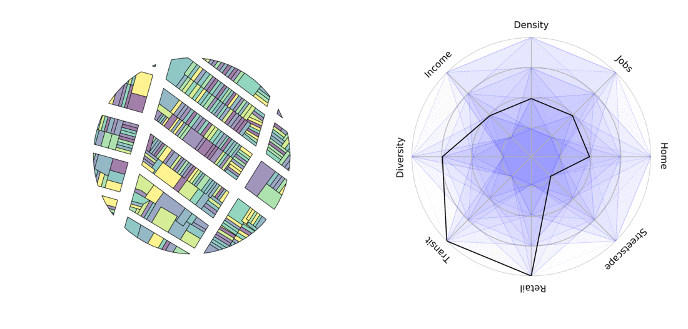

# Overview

In this lab, we will work with different types of points, lines, and polygons data to describe the built environment. Planners are often interested in understanding and improving urban spaces. We will develop simple metrics to quantify physical environmental characteristics.



To put things into context, we are going to describe **pedestrian-friendly built environment** in Boston neighborhoods. Urban factors such as the presence of walking facilities, the density and variety of businesses, streetscape elements like benches, storefronts, shade and parks all influence the extent and nature of walkable areas ([Lai & Kontokosta, 2018](https://www.sciencedirect.com/science/article/pii/S0169204618308491); [Frank et al., 2006](10.1080/01944360608976725); [Owen et al., 2007](10.1016/j.amepre.2007.07.025); [Ewing & Cervero, 2010](https://doi.org/10.1080/01944361003766766)).

```{r}
#| message: false
library(sf)
library(tidyverse)
library(osmdata)
library(DT)
library(scales)
```

For the purpose of demonstrating how to gather, combine and analyze spatial data from different sources, we are going to develop three relatively simple indicators to measure the pedestrian environment in a Boston neighborhoods: **sidewalk density, open space coverage, and** **number of** **restaurants measured by points of interest (POI).**

# Boston Neighborhoods

From Analyze Boston, let's navigate to the [Boston neighborhood boundaries](https://data.boston.gov/dataset/boston-neighborhood-boundaries-approximated-by-2020-census-block-groups1) page. Find the **shapefile** format, click Download. Save the zipped file to your project folder and then Unzip it.

Keep everything unzipped in the same folder. We will look here to find the ".shp" file to read, but all other files need to be there to make a complete shapefile.

> Note: If you are interested, here is how we can directly unzip a file with R commands.
>
> ```{verbatim}
> unzip(zipfile = "your_file_name.zip", exdir = "data", overwrite = TRUE)   
> file.remove("your_file_name.zip")
> ```

Use `st_read()` in the `sf` package to read in the shapefile. You may want to apply the correct path on your end.

```{verbatim}
neighborhood <- st_read("data/Boston_Neighborhood_Boundaries_approximated_by_2020_Census_Block_Groups.shp")
```

```{r}
#| message: false
#| echo: false
#| results: hide
neighborhood <- st_read("../data/Boston_Neighborhood_Boundaries_approximated_by_2020_Census_Block_Groups.shp")
```

This shapefile shows Boston neighborhood boundaries, approximated using census block groups. See the data download page for details on how it was created. This approach provides a variety of demographic data at the neighborhood level, even though neighborhoods are not official census units.

There are many columns in this dataset. We will choose the ones we need (neighborhood names and population) and assign them identifiable names.

```{r}
neighborhood <- neighborhood |>       
  select(nbh_name = blockgr202, 
         population = tot_pop_al)
```

Note that **selection does not remove the `geometry`** column. Geometries are "sticky," meaning this column will stay attached to your table unless you explicitly remove them using `st_drop_geometry()`.

# Strategize Our Task

Eventually we aim to have a table where each row represents a neighborhood, and each column provides the values of a specific indicator, such as:

| Neighborhood | Sidewalk Density | Open Space Coverage | Number of Restaurants |
|------------------|------------------|------------------|-------------------|
| Allston      | xx               | xx                  | xx                    |
| Back Bay     | xx               | xx                  | xx                    |

-   We have [line data for sidewalks](https://data.boston.gov/dataset/sidewalk-centerline). But we need to split sidewalks at neighborhood boundaries (`st_intersection`), and calculate the total sidewalk length within each neighborhood.

-   Using [open space data](https://data.boston.gov/dataset/open-space), we can also identify the spatial overlap (`st_intersection`) between open space and neighborhoods and find out the areas for parks, squares, and recreational spaces within each neighborhood.

-   We’ll obtain restaurant location data from OpenStreetMap. These are point data, so we’ll count the number of restaurant points within each neighborhood.

-   Then these three tables will be joined together to create the table we want.

# Sidewalk Density

## Calculate feature length

Go to [Sidewalk Centerline](https://data.boston.gov/dataset/sidewalk-centerline) data. This time, try either the geojson file or the shapefile to see how each work. Download it to your data folder, use `st_read()` to read it into R and assign it to a variable (named e.g. "sidewalk").

```{verbatim}
sidewalk <- st_read("data/Sidewalk_Centerline.geojson")
```

```{r}
#| message: false
#| echo: false
#| results: hide
sidewalk <- st_read("../data/Sidewalk_Centerline.geojson")
```

From the message while you are reading, you can see information like:\
*Bounding box: xmin: -71.1822, ymin: 42.2306, xmax: -70.92445, ymax: 42.39663; Geodetic CRS: WGS 84.*

This shows the geometry is measured in degrees. You can also check the results by clicking `sidewalk` in the Environment panel or by using `View(sidewalk)`. Each line’s details are stored in the geometry attribute, where the x,y pairs represent longitude and latitude (in degrees, roughly -71, 42).

The file was created in the geographic coordinate reference system (CRS) EPSG:4326 (WGS 84), which is an "unprojected" system.

```{r}
st_crs(sidewalk)$epsg  
st_crs(sidewalk)$input
```

In order to calculate geometry length, however, we need to project the data into a CRS that uses linear units, such as EPSG:2249 (Massachusetts State Plane). State Plane projections are "projected", and x and y coordinates are measured in feet.

```{r}
sidewalk <- st_transform(sidewalk, 2249)
```

Then we will be able to directly calculate all the feature length using `st_length()`:

```{r}
st_length(sidewalk$geometry) |> head()
```

## Spatial intersection

Then we will perform a spatial intersection. `st_intersection()` finds the shared part of two spatial objects. If we overlay `sidewalks` with the entire `neighborhoods`, it splits sidewalks at neighborhood boundaries. Each split segment is linked to the attributes of the neighborhood it falls within.

But the two spatial files need to have the same projection (i.e. they need to spatially line up) to perform the intersection. Check the CRS of `neighborhood`, it's EPSG: 4326. So we will first use `st_transform` to convert it to the same projection as the sidewalks, EPSG: 2249.

```{r}
neighborhood <- st_transform(neighborhood, crs = 2249)
```

Then we will continue to do the intersection.

```{r}
sidewalk_data <- 
  st_intersection(sidewalk, neighborhood)
```

Note: if you see "warning: attribute variables are assumed to be spatially constant throughout all geometries", it can be safely ignored. It's R saying all road attributes will be applied to all segments after the split.

It takes a few seconds to run, but once finished, sidewalks are split into more rows, neighborhood names are attached, and you can then calculate the length of each segment.

```{r}
sidewalk_data <- 
  sidewalk_data |> 
  mutate(length = as.numeric(st_length(geometry))) 
```

With neighborhood names here in the table, we can now `group_by()` neighborhood and `summarise()` the total sidewalk length in each neighborhood.

```{r}
sidewalk_data <- 
  sidewalk_data |> 
  group_by(nbh_name) |> 
  summarise(sidewalk_length = sum(length)) |> 
  st_drop_geometry()
```

I've dropped the geometry so we have a plain table, which will make it easier to join in later steps. When it's finished, you can `View(sidewalk_data)` . It has 24 rows, showing the total sidewalk length (in feet) in each neighborhood.

# Open Space Coverage

We have open space property data maintained by the Boston Parks and Recreation Department. It provides shapes, names, ownership, and type of each property. You can check the [open space data download page](https://data.boston.gov/dataset/open-space) and metadata on the linked page.

Let's download and read this file. Open spaces are polygon data. As usual, check what each column means and the CRS. This data also uses EPSG: 4326. To calculate areas, we need to use `st_transform()` to convert it to the same projection as the sidewalks, EPSG: 2249.

```{r}
#| echo: false
#| results: hide
parks <- st_read("../data/open_space.json") |> 
  st_transform(2249)
```

Similar to the sidewalk data, we will use `st_intersection()` to get the part of open space contained within each neighborhood.

Once we have that, use `st_area()` to calculate the overlapping areas (in sq.ft.), and then summarize the total areas by neighborhood. In the following code, we chained these steps together into one sequence.

```{r}
park_data <- 
  st_intersection(parks, neighborhood) |> 
  mutate(area = as.numeric(st_area(geometry))) |> 
  group_by(nbh_name) |> 
  summarize(park_area = sum(area)) |> 
  st_drop_geometry()
```

When it's finished, you will have a `park_data` object that has 24 rows.

We are almost there, next we are going to collect restaurant locations from OpenStreetMap (OSM). Before the transition, we can delete a few intermediate objects in the R environment that are no longer needed to free up memory:

```{r}
rm(sidewalk, parks)
```

# Obtain and Process OSM data

OSM is a collaborative mapping platform that allows users to contribute to its database and offers convenient options for downloading data through its free [Overpass API](https://overpass-turbo.eu/#). In this lab, we will use the [`osmdata` R package](https://cran.r-project.org/web/packages/osmdata/vignettes/osmdata.html), which simplifies API download queries without much understanding of the overpass syntax.

In order to obtain data from OSM, you will need to specify:

-   a bounding box
-   key-value pairs

### The bounding box

A bounding box is like a window of where you want to clip a piece of map. It can be defined by manually specifying two longitude (x) - latitude (y) pairs. The following example defines one bounding box for Boston area, the first pair (-71.188, 42.238) is the lower-left corner (southwest), and the second pair (-70.924, 42.393) is the upper-right corner (northeast)

```{r}
#| message: false
# A bounding box for Boston
bbox = c(-71.188, 42.238, -70.924, 42.393)
```

### The key-value pairs

An overpass query `opq` starts with engaging with the bounding box like this:

`q <- opq(bbox)`

Following the initial `opq(bbox)` call, we will build queries by adding one or more features (`add_osm_feature()`). Features are defined by ***key-value pairs***. For example, restaurants are categorized in OSM under `key=amenity`, and `value=restaurant`. Here is [a complete list of key-value pairs on OSM](https://wiki.openstreetmap.org/wiki/Map_Features).

A query of all restaurants within the bounding box of Boston will be constructed as follows:

```{r}
restaurants <- opq(bbox)|>   
  add_osm_feature(key = "amenity", value = "restaurant") |>  
  osmdata_sf() 
```

The retrieved object `restaurants` is a large list with many attributes; What we need is one named `osm_points` nested in this list. The following code extracts `osm_ponits`, and selects only the `name` attribute and the associated geometry.

```{r}
restaurants <- 
  restaurants$osm_points |> 
  select(name)
```

Now we have all the restaurant locations. You can `View` the `restaurants` object. If you notice many missing values (NAs) in the names, scroll down to find more typical entries of restaurant names. This is a common issue with crowdsourced data like OSM, where the information provided may be incomplete.

> Note: if you want to visually check your result, use `mapview(restaurants, legend = FALSE)`

Check the CRS of `restaurant`. We want to associate our downloaded OSM data with the `neighborhood` shapefile, so again let's convert it using `st_transform()`.

```{r}
restaurants <- st_transform(restaurants, 2249)
```

Below I am repeating the "download, extract, and transform" process. You can try it with any other OSM data, such as grocery stores, fast food places, and other amenities, by applying the corresponding key-value pairs.

```{r}
# bbox = c(-71.188, 42.238, -70.924, 42.393)
# restaurants <- 
#   opq(bbox)|>   
#   add_osm_feature(key = "amenity", value = "restaurant") |>  
#   osmdata_sf() |> 
#   pluck("osm_points") |> 
#   select(name)|> 
#   st_transform(2249)
  
```

## Calculate the number of POIs by neighborhood

We now have a point shapefile (`restaurants`) and a polygon shapefile (`neighborhood`), and we want to count the number of points in each neighborhood. The same process: intersection, and then count by neighborhood.

```{r}
restaurant_data <- 
  st_intersection(restaurants, neighborhood) |> 
  count(nbh_name, name = "restaurant") |> 
  st_drop_geometry()
```

# Assemble Results

After calculating the three elements separately, we now have the following tables for each neighborhood:

-   `sidewalk_data`: Total sidewalk length in feet.
-   `park_data`: Total area of open space in square feet.
-   `restaurant_data`: Number of POIs for restaurants.

To create comparable metrics, we'll normalize the raw data by calculating:

-   **Sidewalk density:** total sidewalk length divided by neighborhood area (ft/sq.ft)
-   **Open space coverage:** total open space area divided by neighborhood area (sq.ft/sq.ft)
-   **POI per capita:** total restaurant POIs divided by neighborhood population

Okay, do we have the population and area of the neighborhoods? Check out the `neighborhood` shapefile we have, yes, population is there, and we just need to calculate the area.

```{r}
neighborhood <- neighborhood |> 
  mutate(area = as.numeric(st_area(geometry))) 
```

Up to this step we have four datasets: `neighborhood`, `sidewalk_data`, `tree_data`, and `restaurant_data`, all sharing the key column `nbh_name`.

Last time we have seen `left_join()`, which merges two datasets by **keeping all rows from the left** and adding matching rows from the right based on a specified key column(s). If nothing is matched, will fill in NA.

Keeping `neighborhood` on the left, we can join the other three tables one by one:

```{r}
result <- 
  neighborhood |> 
  left_join(sidewalk_data, by = "nbh_name") |> 
  left_join(park_data, by = "nbh_name") |> 
  left_join(restaurant_data, by = "nbh_name") 
```

Let's calculate the normalized metrics. Normalization can be done with a series of `mutate()` functions as shown below. Following that, we will `select()` only the final output columns:

```{r}
result <- result |> 
  mutate(sidewalk_density = sidewalk_length/area, 
         park_coverage = park_area/area,
         restaurant_density = restaurant/population) |> 
  select(nbh_name, sidewalk_density:restaurant_density) 
```

Here we've got our final, summary table.

```{r}
result
```

# Present Our Result

There are plenty of ways to create nicer, more presentable tables. We have tried `gt`, you can also check out packages such as `kable`. Today we are going to use `DT` (for **D**ata**T**ables). It provides some interactive functions such as sorting and "show more".

The following code makes a datatable for our results.

```{verbatim}
result |> 
  st_drop_geometry() |> 
  datatable()
```

The calculated values may be very small, and hard to distinguish. You can `rescale()` them to a range of 1-100 to create standardized "scores" for each neighborhood.

```{r}
scores <- result |>
  mutate(across(
    sidewalk_density:restaurant_density,
    ~ rescale(., to = c(1, 100)) |> round(2)
  ))

scores |> 
  st_drop_geometry() |> 
  datatable()
```

------------------------------------------------------------------------

As our result is a spatial object, we can also create maps to show the scores in neighborhoods:

```{r}
scores |> 
  pivot_longer(cols = sidewalk_density:restaurant_density,
               names_to = "indicators", values_to = "score") |> 
  ggplot()+
    geom_sf(aes(fill = score))+
    facet_wrap(~ indicators)+
    scale_fill_viridis_c()+
    theme_void()
```

------------------------------------------------------------------------

We can also make some [radar charts](https://r-graph-gallery.com/143-spider-chart-with-saveral-individuals.html) to show these scores:

```{r}
my_neighborhood <- "Downtown"

# install.packages("fmsb")
library(fmsb)

# Create a table in the format required by the radar chart
# including rows for maximum and minimum values to set the chart scale
chart <- rbind(
  c(100, 100, 100),  # Max values
  c(1, 1, 1),        # Min values
  scores |> 
    st_drop_geometry() |> 
    filter(nbh_name == my_neighborhood) |>
    select(sidewalk_density:restaurant_density)
)
```

```{r}
# Plot radar chart
radarchart(chart, title = my_neighborhood)
```

Many examples for customizing radar charts are available on the linked page. You can also check `?radarchart` for for details on all options.

```{r}
radarchart(chart,
  axistype = 1,
  #custom polygon
  pcol = rgb(0.2, 0.5, 0.8, 0.9),
  pfcol = rgb(0.2, 0.5, 0.8, 0.3),
  plwd = 3,
  #custom the grid
  cglcol = "lightgrey",
  cglty = 1,
  cglwd = 0.8,
  #custom labels
  axislabcol = "darkgrey",
  caxislabels = seq(0, 100, 20),
  vlcex = 0.8
)
```

# Exercise

What other indicators can you use to describe the built environment in Boston neighborhoods? For example, their transit supply (e.g. the number of [bus stops](https://gis.data.mass.gov/datasets/massgis::mbta-bus-stops-3/explore?location=42.346124%2C-71.067200%2C10.03), [rail stops](https://www.mass.gov/info-details/massgis-data-mbta-rapid-transit), or [Bluebike stations](https://bluebikes.com/system-data)), business activities (e.g., [supermarkets, cafes](https://wiki.openstreetmap.org/wiki/Map_features) on OSM), [trees](https://data.boston.gov/dataset/bprd-trees), [public schools](https://data.boston.gov/dataset/public-schools), [pedestrian ramps](https://data.boston.gov/dataset/pedestrian-ramp-inventory).

In this exercise, you’ll continue exploring Boston neighborhoods by replicating and expanding on our process. Start by a interesting topic, then choose 2-3 indicators that you find meaningful, think about how you might calculate them, and then use spatial tools to work through your calculations. When you're ready, present your results in your preferred way.

You can download the datasets you need from Boston data sources or OSM. Feel free to use any of the code provided earlier that you find helpful. But keep in mind the primary goal of this exercise is to practice spatial analysis in R. You should operationalize your metrics in a manageable way and choose indicators that work for you.

# Lab Report

Please create a new Quarto document for this exercise and use it to document your work. When you are ready, submit the Rendered HTML file. As usual, make sure you have included `embed-resources: true` in your YAML header, this is to help preserve all your pictures in your HTML.

{width="424"}

Please **upload your report to Canvas** **by 9am, Wednesday, Oct 8.**
