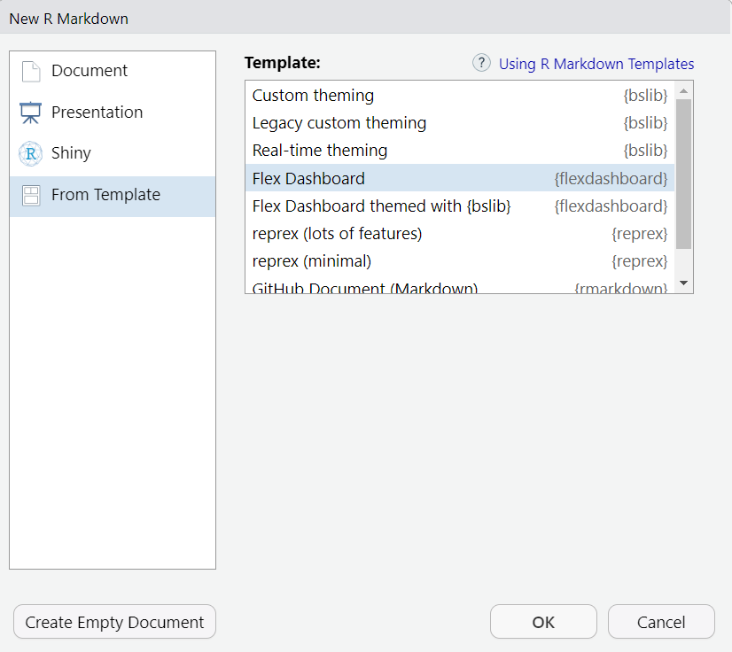
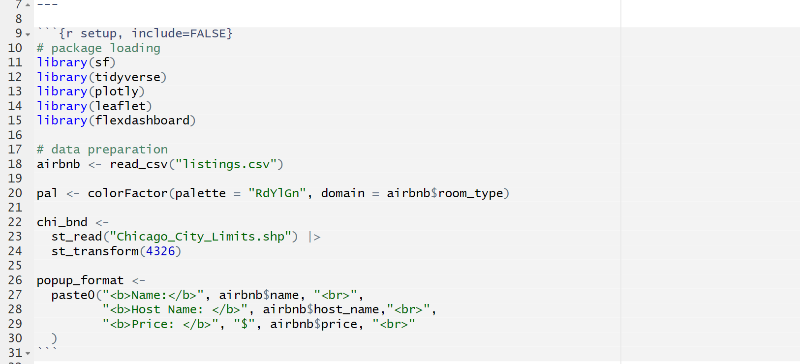
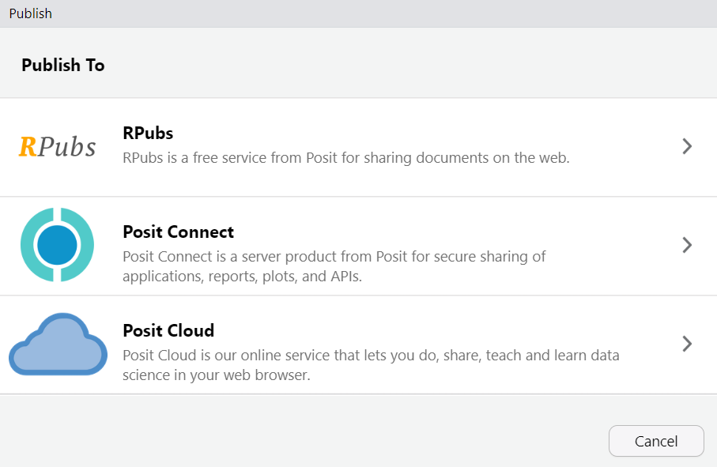
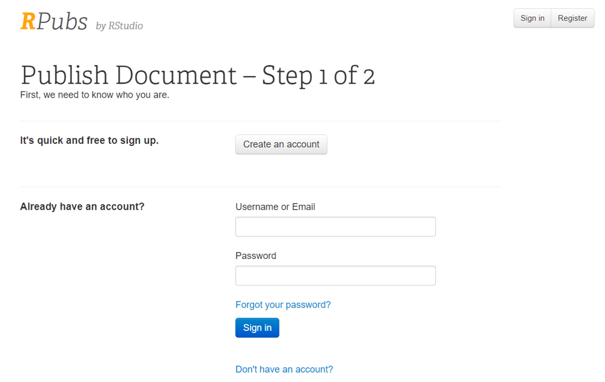
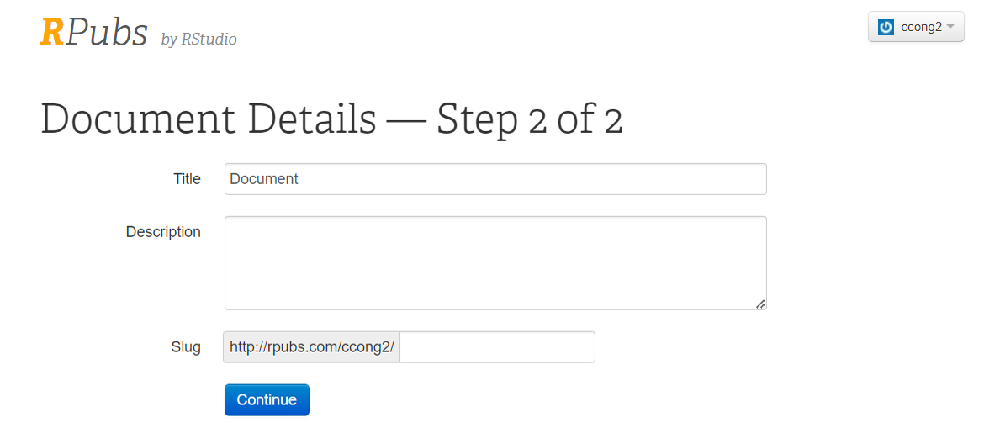

# Overview

Today we are going to practice making interactive maps using **Leaflet**, and integrating our visualizations into a **Flexdashboard**. We will use an example of analyzing Airbnb data in Boston to illustrate how to use these new tools.

To get started, create a new project folder to hold your files and open a new **R script** to follow along with the code examples. Once everything is working, you’ll be asked to place different parts of the code correctly within the Flexdashboard layout.

```{r}
#| message: false
# You may need to install leaflet and flexdashboard packages
library(tidyverse)
library(sf)
library(plotly)
library(leaflet)
library(flexdashboard)
```

# Prepare the data

We’re back on **Inside Airbnb**, but this time take a look at the ["Explore the Data"](https://insideairbnb.com/explore/) page, where the scraped Airbnb data are visualized through maps and graphs. When you click on a city (e.g. Boston), you’ll find an interactive map showing where properties are. Hovering over the points displays a tooltip with details such as name, price, and recent activities. On the right side, there are several graphs that the creators made to interpret what they've found in the data and discuss the impact of short-term rentals on this city.

From the menu of this page, head back to Data → Get the Data. We’ll again use Boston as our example. Go ahead and download the `listings.csv.gz` file for the city of Boston, or, if you already have it from before, read it in from your local files.

```{verbatim}
airbnb <- read_csv("data/listings.csv.gz")
```

```{r}
#| message: false
#| include: false
airbnb <- read_csv("../data/listings.csv.gz")
```

# Introduce `leaflet` interactive maps

The general steps for creating a Leaflet map are very similar to the "layered" approach of `ggplot` .

1.  Initiate `leaflet()`
2.  Add basemaps with `addProviderTiles()`
    -   Can set the map's view to a specific location and zoom level
3.  Add geometric object(s)
    -   `addCircles()` for points
    -   `addPolygons()` for shapes
    -   `addPolylines()` for lines
4.  Add a color palette and a legend
    -   `colorFactor()` for representing categorical variables
    -   `colorBin(), colorQuantile()` for representing numeric variables
5.  Add additional elements and layer controls
    -   `addLegend`
    -   `addLayersControl()`

## Work Process

### Basemap

We first initiate `leaflet()`. Then using `addTiles()` , you can add a basemap, and with `setView()` , you can set a center point and a zoom level of your initial view. Run the following code to set our view to Boston.

```{verbatim}
leaflet() |>
  addTiles() |>
  setView(lng = -71.0810, lat = 42.3342, zoom = 12) 
```

By default, `addTiles()` generates a basemap using [OpenStreetMap tiles](https://www.openstreetmap.org/#map=5/38.50/-85.75). They’re suitable, but there are many alternatives. Check out a [basemap provider list](https://leaflet-extras.github.io/leaflet-providers/preview/) here. You can use `addProviderTiles()` instead to select from some other third-party basemaps.

The `zoom` argument sets the initial zoom level. Higher values zoom in closer to the map’s center.

I’m partial to the washed simplicity of the “CartoDB.Positron” tiles, so I’ll use those in the maps that follow.

```{r}
#| class-source: "numberLines"
#| source-line-numbers: "2"
leaflet() |>
  addProviderTiles(providers$CartoDB.Positron)|>
  setView(lng = -71.0810, lat = 42.3342, zoom = 12) 
```

### Circles

Then we can add all Airbnb listings to the map. Leaflet use circles or circle markers to work with point data. Different from the one-dimensional points in ggplot, circles let you define additional attributes such as: circle size (`radius`), whether to have strokes (`stroke=TRUE`) or fill (`fill=TRUE`), with what fill color (`fillColor`) and transparency (`fillOpacity`), etc.,

```{r}
#| class-source: "numberLines"
#| source-line-numbers: "4-8"
leaflet() |>
  addProviderTiles(providers$CartoDB.Positron) |>  
  setView(lng = -71.0810, lat = 42.3342, zoom = 12)|>  
  addCircles(data = airbnb,
             fill = TRUE,
             fillOpacity = 0.7,
             stroke = FALSE, 
             radius = 1) 
```

### Color

#### **Function-Based Color Mapping**

Rather than showing all properties in one color, we might want to differentiate them by, for example, room type.

In `ggplot2`, when you specify `color = <variable name>`, ggplot automatically map colors based on your variable values. However, Leaflet doesn’t know how to handle colors unless you tell it. You will need to create a color palette (`pal`) using **color mapping functions** to explicitly define how values in your variable correspond to colors.

#### **Define `pal` using color mapping functions**:

In the following line of code, we are defining our color palette `pal` using a color mapping function `colorFactor()`. This builds a relationship between the **categorical values in the `airbnb$room_type`** variable and **a color ramp** **("RdYlGn" – red, yellow, green)**.

`pal <- colorFactor(palette = "RdYlGn", domain = airbnb$room_type)`

We used `colorFactor()` because variables in `room_type` are categorical. For numeric data, we will instead use `colorBin()` , which divides the range into "equal intervals"; and `colorQuantile()` , which creates quantiles for varying values.

#### **Applying `pal` to Map Elements**

Once defined, you can use `pal` in multiple places on your map to consistently apply the color mapping. In the following code, the palette is passed to two things:

1\) **`fillColor = ~pal(room_type)` so that each room type will be filled with its corresponding color.** The `~` is a formula notation saying `pal` will be applied to `room_type`, which is not a separate variable, but an attribute inside the data provided (in this case, `data = airbnb`)

2\) **`addLegend(pal = pal)` so that colors in the legend will show up accordingly.** Note that `addLegend()` doesn't use `~`, because it does not require a data argument as in `addCircles()`. It simply puts together a defined color mapping function `pal` and a plain vector of values `airbnb$room_type`.

```{r}
#| class-source: "numberLines"
#| source-line-numbers: "1,7,13-14"
pal <- colorFactor(palette = "RdYlGn", domain = airbnb$room_type)

leaflet() |>
  addProviderTiles(providers$CartoDB.Positron) |>  
  setView(lng = -71.0810, lat = 42.3342, zoom = 12)|>  
  addCircles(data = airbnb,
             fillColor = ~pal(room_type),
             fillOpacity = 0.7,
             stroke = FALSE, 
             radius = 1) |>
  addLegend(
    position = 'topright',
    pal = pal,
    values = airbnb$room_type,
    title = "Room Type"
  )
```

### Polygons

Polygon shapes can be added to leaflet through `addPolygons()`. For every city, neighborhood shapefiles are also provided in the [data downloading page](https://insideairbnb.com/get-the-data/). Here we can download the "neighbourhoods.geojson" for Boston, and read it into R using appropriate `sf` functions.

```{verbatim}
boundary <- st_read("data/neighbourhoods.geojson")
```

```{r}
#| message: false
#| include: false
boundary <- st_read("../data/neighbourhoods.geojson")
```

In previous labs, we have been transforming most shapes to 2249, because we were either calculating areas/lengths, or performing spatial calculations that require projection alignment. For **web mapping**, however, **EPSG:4326 is always used** because the longitude-latitude system is the standard used by GPS as well as most online mapping platforms.

Now we will add neighborhood boundary to our map, while also adjusting the boundary color, width, and setting the fill color to transparent.

```{r}
#| class-source: "numberLines"
#| source-line-numbers: "9-12"
leaflet() |>
  addProviderTiles(providers$CartoDB.Positron) |>  
  setView(lng = -71.0810, lat = 42.3342, zoom = 12)|>  
  addCircles(data = airbnb,
             fillColor = ~pal(room_type),
             fillOpacity = 0.7,
             stroke = FALSE, 
             radius = 1) |>
  addPolygons(data = boundary,
              color = "blue",
              fill = FALSE,
              weight = 1) |>
  addLegend(
    position = 'topright',
    pal = pal,
    values = airbnb$room_type,
    title = "Room Type"
  )
```

### Popup labels

Pop-ups show information when clicking a map item. In our example, each circle represents one Airbnb listing. We can request the map to show an attribute of this listing (such as `name`) when clicking it.

```{r}
#| eval: false
#| class-source: "numberLines"
#| source-line-numbers: "6"
addCircles(data = airbnb,
           fillColor = ~pal(room_type),
           fillOpacity = 0.7,
           stroke = FALSE, 
           radius = 1,
           popup = ~name)
```

Or, displays more than one attributes, such as `name`, `host_name` and `price`:

```{r}
#| eval: false
#| class-source: "numberLines"
#| source-line-numbers: "6"
addCircles(data = airbnb,
           fillColor = ~pal(room_type),
           fillOpacity = 0.7,
           stroke = FALSE, 
           radius = 1,
           popup = ~paste(name, host_name, price)) 
```

Same as before, we use `~` to indicate the names we reference come from the dataset specified in the data argument, rather than being separate variables in the R environment.

Right now all information are displayed in one continuous row, which is not easy to read. But we can fix this by **defining a label format** **outside of the plotting process**. We can even control the appearance of pop-up information using line breaks `<br>` , or making text bold . For example:

```{r}
#| class-source: "numberLines"
#| source-line-numbers: "1-5,15"
popup_format <-
  paste0("<b>Name:</b>", airbnb$name, "<br>",
         "<b>Host Name: </b>", airbnb$host_name,"<br>",
         "<b>Price: </b>", airbnb$price, "<br>"
  )

leaflet() |>
  addProviderTiles(providers$CartoDB.Positron) |>
  setView(lng = -71.0810, lat = 42.3342, zoom = 12)|>  
  addCircles(data = airbnb,
             fillColor = ~pal(room_type),
             fillOpacity = 0.7,
             stroke = FALSE, 
             radius = 1,
             popup = popup_format) |>
  addPolygons(data = boundary,
              color = "blue",
              fill = FALSE,
              weight = 1) |>
  addLegend(
    position = 'topright',
    pal = pal,
    values = airbnb$room_type,
    title = "Room Type"
  )
```

For the last step, we will add a layer control to turn on and off layer groups as we wish!

### Layer Control

In the following code, we are assigning each item we added into a **group**. Then these group names are passed to the `addLayersControl()` for users to toggle on and off.

Add these layer control lines to your code - be careful to match all parentheses and commas correctly.

```{r}
#| class-source: "numberLines"
#| source-line-numbers: "3-7,15,20,26-31"
leaflet() |>
  # More basemaps to choose from
  addProviderTiles(providers$CartoDB.Positron,
                   group = "CartoDB Positron") |>
  addProviderTiles(providers$Esri.WorldImagery, 
                   group = "ESRI World Imagery") |>
  addProviderTiles(providers$CartoDB.DarkMatter, 
                   group = "CartoDB Dark") |>
  setView(lng = -71.0810, lat = 42.3342, zoom = 12)|>  
  addCircles(data = airbnb,
             fillColor = ~pal(room_type),
             fillOpacity = 0.7,
             stroke = FALSE, 
             radius = 1,
             popup = popup_format,
             group = "Airbnb Listings") |>
  addPolygons(data = boundary,
              color = "blue",
              fill = FALSE,
              weight = 1, 
              group = "Neighborhood Boundary") |>
  addLegend(
    position = 'topright',
    pal = pal,
    values = airbnb$room_type,
    title = "Room Type") |> 
  addLayersControl(
    baseGroups = c("CartoDB Positron", 
                   "ESRI World Imagery",
                   "CartoDB Dark"),
    overlayGroups = c("Airbnb Listings", "Neighborhood Boundary")
  )

```

You should now have your Leaflet map up and running. Test the code to make sure it works and displays the map as expected. You can save your code to a R file so you don't lose your work.

# Introduce `flexdashboard`

Crafting a fundamental `flexdashboard` does not require additional web development knowledge, as it relies on R code and offers ready-to-use templates. From your RStudio interface, let's go to **File - New File - R Markdown.**

In the popped-up window, select **"From Template" - "Flex Dashboard"**

{width="547"}

You will have a new opened file that serves as the template of the dashboard. Save this file as **"flexdashboard.Rmd"**

Go ahead click **"Knit" - "Knit to flex_dashboard"**. (knit is just another word for render). You now should see a blank dashboard. Any code you put into the "Chart A", "Chart B" and "Chart C" sections will be displayed in their corresponding spaces!

## Populate a flexdashboard template

Our Leaflet map code begins with `leaflet() |>` and continues through to the layer control at the end. Let's copy this entire section and **paste it into** **the blank code chunk under "Chart A"**.

Above "Chart A", and just below the YAML header, there is aonther code chuck named `setup` and marked `include = FALSE`. This chunk is meant for any data processing before the mapping/plotting code. So let's copy all the code for loading packages and reading in your data into this setup chunk.

{width="687"}

Save the **flexdashboard.Rmd** and **Knit** it again, see if it works and correctly show the map.

Now for the other two areas "Chart B" and "Chart C", it’s your turn to add more graphs! You may want to go back to your Lab 3 work and pick some graphs you like best to display here. After this, you will have your own story board for the Airbnb data.

When working on your previous code, pay attention identifying different steps and place them in the correct spots: **any data processing goes in the setup chunk, and the plotting code goes in the respective chart chunk.** Feel free to tweak or improve your Lab 3 graphs, this is a great chance to make your visualizations even better!

In the meantime, there are plenty of ways to move beyond the default three-panel layout in **flexdashboard**. Check out [Sample Layouts](https://pkgs.rstudio.com/flexdashboard/articles/layouts.html), which offers a variety of examples you can use as a starting point for your own dashboards. The [Using flexdashboard](https://pkgs.rstudio.com/flexdashboard/articles/using.html) page is also helpful for learning how to adjust panel and chart sizes, explore supported components, and apply theming.

# Exercise

## Make your own dashboard

For this week’s assignment, continue working on the city you’ve chosen and create a flexdashboard that includes **one Leaflet map** and **at least two graphs** to showcase its Airbnb listings.

Feel free to get creative: experiment with more Leaflet functions, explore new ways to plot your data, or adjust panel layouts. The goal is to make the dashboard both informative and engaging, so have fun exploring flexdashboard and making it your own!

## Publish your work

Since this is such a comprehensive project, let’s publish it as a webpage! Every time you knit, the dashboard runs on your local server. On the top-right corner of the rendered page, you will find a blue icon called **"Publish"**. From the dropdown button, click **"Publish Document"**.

You will be directed to this screen below. If you are prompted that some packages are required, you'll need to install them first (most often: `rsconnect`).

{width="453"}

**Click RPubs** - then in the next screen, you will need to either sign in (if you have used Rpubs before), or create a new account.

{width="515"}

Then this will be the last step: you can title your project, and choose an url string you would like to use to identify your project.

{width="504"}

Click Continue. Then after just a few seconds, you can visit your dashboard using your URL in a web browser!

[The blue icon](https://docs.posit.co/connect/user/publishing-rstudio/#:~:text=The%20blue%20Publishing%20icon%20in,viewer%20when%20viewing%20a%20document) is helpful for publishing almost anything you've created: documents, plots, graphs, websites, etc. You can use it to publish individual Leaflet maps [like this](https://rpubs.com/ccong2/leafletdemo), or quickly publish any of the HTML files you have been creating for our labs.

Please submit your **flexdashboard.Rmd** and **the link to your RPubs dashboard** to Canvas. **You can paste your link into the submission comments area.**

Please upload your report to Canvas by **9am, Wednesday, Oct 29.**
